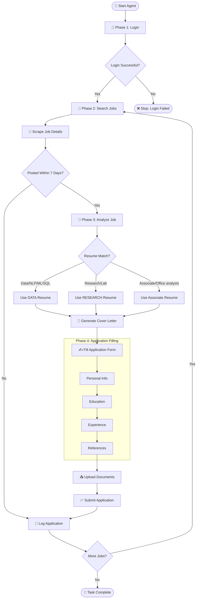

# 🤖 UB Job Application Agent, Built from Scratch

> **"Automating my job search with precision and zero effort."**

---

## 🌟 Overview  
I built a fully automated agent that logs into the University at Buffalo job portal, scans newly posted jobs, analyzes each description, selects the best-fit resume, generates a tailored cover letter, fills out the job application form, uploads all required documents, and submits the application.

This is my **UB Job Application Agent**; end-to-end automation for job applications at UB.

---

## ⭐ What This Agent Does  

An end-to-end automation system that:

- Logs into the UB Jobs Portal  
- Scrapes newly posted positions  
- Classifies each job into **DATA**, **RESEARCH**, or **ASSOCIATE** resume category  
- Generates a **customized DOCX cover letter**  
- Fills the entire application form  
- Uploads documents  
- Logs everything in a tracking system  

📌 **One script → Complete job application lifecycle**
---

## 🗺️ Workflow Diagram --> Full Blueprint

---
## 🏗️ How I Built It  

I constructed this system step by step, ensuring every module works independently and together.

### **1. Scraper (Job Reader) 👀**
- Opens UB Jobs using **Playwright**.
- Extracts job titles, departments, posting dates, and descriptions.
- Filters jobs to only include those posted within the last **7 days**.

### **2. Classifier (Keyword Matcher) 🧠**
- Reads each job description.
- Counts relevant keywords.
- Matches the job to the correct resume type:
  - **DATA Related Resume**
  - **Academic RESEARCH Related Resume**
  - **ASSOCIATE Resume**

### **3. Writer (Cover Letter Generator) ✍️**
- Loads my prepared template.
- Inserts job-specific details (title, department, skills).
- Saves each cover letter in `generated_docs/`.

### **4. Form Filler (Applicant Bot) 🖐️**
- Types all required personal information.
- Fills Education → Experience → Skills → References.
- Uploads the selected resume and generated letter.
- Clicks **Submit** after validation.

---

## 🔧 Tech Stack

**Core Language**
- 🐍 Python

**Automation & Web Interaction**
- 🎭 Playwright (Sync API)

**LLM Integration**
- 🤖 OpenAI API (Cover letter generator)

**Data Handling**
- 📊 pandas  
- 📄 openpyxl  
- 🔍 beautifulsoup4  

**Document Generation**
- 📝 python-docx  
- ✏️ docx.shared.Pt (styling)

**Environment & Configuration**
- 🌱 python-dotenv  
- 🗂️ os / sys for file + directory management  
- ⏱️ datetime for timestamps  

**Utilities**
- 🔤 re (regex parser)  
- 📁 pathlib (implicitly supported by Python)
---
> ⚠️ **Note:** You’ll notice some absolutely ridiculous placeholders in my personal info throughout this repo.  
> They’re intentional. I’m not out here dropping my real details for the bots to harvest. 😄
